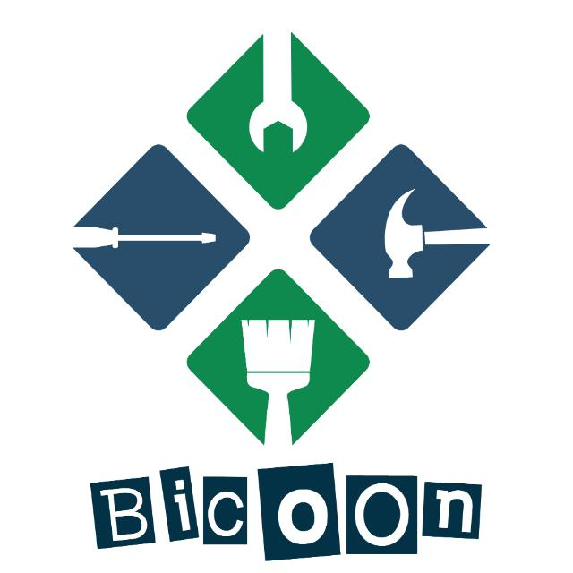

# BicoOn

<div align="center">
  <a href="https://www.java.com/pt-BR/" target="_blank" rel="noreferrer" rel="noopener">
    
  </a>
  <a href="https://spring.io/" target="_blank" rel="noreferrer" rel="noopener">
    
  </a>
  <a href="https://git-scm.com/" target="_blank" rel="noreferrer" rel="noopener">
    
  </a>
  <a href="https://www.microsoft.com/pt-br/windows/?r=1" target="_blank" rel="noreferrer" rel="noopener">
  
</div></br>

<div align="center">
  
</div></br>

> O BicoOn é um projeto desenvolvido para conectar prestadores de serviços informais e clientes, ele permite que pessoas acessem o contato e os serviços de diferentes profissionais por cidade.

### Ajustes e melhorias

O projeto ainda está em desenvolvimento e as próximas atualizações serão voltadas nas seguintes tarefas:

- [x] Monitoramento com Actuator
- [x] Documentação com Swagger
- [ ] Deploy no Heroku
- [ ] Interface Gráfica
- [ ] Agendamento de serviços do Prestador
- [ ] Chat interno para comunicação entre Prestador e Cliente

## 💻 Pré-requisitos

Antes de começar, verifique se você atendeu aos seguintes requisitos:

* Você instalou a  linguagem `Java JDK 17 LTS`
* Você tem uma máquina `Windows 10 ou 11`.

## 📃 Swagger

Para acessar a documentação BicoOn, siga estas etapas:

1. Baixe o arquivo:</br>
<div>
  <a href="https://github.com/yhonathanpavan/Compass.UOL-Projeto-BicoOn/blob/master/BicoOnApi.yml" target="_blank" rel="noreferrer"     rel="noopener"> <b> BicoOn </b> </a>.
</div>
2. Abra o Swagger Online: </br>
<div>
  <a href="https://editor.swagger.io/?_ga=2.185135209.135771497.1650906792-744667863.1647286784" target="_blank" rel="noreferrer"     rel="noopener"> <b> Swagger Editor </b> </a>.
</div>
3. Em seguida é só importar, clique em File, Import File e selecione o arquivo BicoOnApi. </br>
4. Por fim, execute o aplicação BicoOnApplication, após isso a documentação estará pronta para uso. 

## ☕ Usando <nBiconOnto>

Para acessar os endpoints da Entidade Cliente, acesse:
```
  GET - /bicoon/clientes (Lista todos os clientes cadastrados) 
```
```
  GET - /bicoon/clientes/{id} (Detalha o cadastro de um cliente existente pelo ID)
```
```
  POST - /bicoon/clientes (Cadastra um novo cliente) 
```
```
  PUT - /bicoon/clientes/{id} (Atualiza o cadastro de um cliente existente pelo ID) 
```
```
  DELETE - /bicoon/clientes/{id} (Remove o cadastro de um cliente existente pelo ID) 
```

Para acessar os endpoints da Entidade Prestador, acesse:
```
  GET - /bicoon/prestadores (Lista todos os prestadores cadastrados) 
```
```
  GET - /bicoon/prestadores (Detalha o cadastro de um prestador existente pelo ID)
```
```
  POST - /bicoon/prestadores (Cadastra um novo prestador) 
```
```
  PUT - /bicoon/prestadores/{id} (Atualiza o cadastro de um prestador existente pelo ID) 
```
```
  DELETE - /bicoon/prestadores/{id} (Remove o cadastro de um prestador existente pelo ID) 
```
  
Para acessar os endpoints da Entidade Avaliação, acesse:
```
  POST - /bicoon/avaliacoes/clientes/{clienteId}/prestadores/{prestadorId}(Cadastra um nova avaliação para um Prestador) 
```
```
  PUT - /bicoon/avaliacoes/{id} (Atualiza uma avaliação existente pelo ID) 
```
```
  DELETE - /bicoon/avaliacoes/{id} (Remove uma avaliação existente pelo ID) 
```
  
Para acessar os endpoints da Entidade Serviço, acesse:
```
  POST - /bicoon/avaliacoes/clientes/{clienteId}/prestadores/{prestadorId}(Cadastra um nova avaliação para um Prestador) 
```
```
  PUT - /bicoon/avaliacoes/{id} (Atualiza uma avaliação existente pelo ID) 
```
```
  DELETE - /bicoon/avaliacoes/{id} (Remove uma avaliação existente pelo ID) 
```
  

## ☎️ Suporte BicoOn
  
Caso tenha dúvidas, reclamações ou sugestões, contate os desenvolvedores. 

## 👩‍💻👨‍💻 Desenvolvedores

Agradecemos às seguintes pessoas que contribuíram para este projeto:

<table>
  <tr>
    <td align="center">
      <a href="#">
        <br>
        <sub>
          <div align="center">
            <b>Alan Silva</b></br></br>
            <a href="https://www.linkedin.com/in/dev-alanfernando/" target="_blank" rel="noreferrer" rel="noopener">
              
            </a></br>
            <a href="mailto:alanfernando2809@gmail.com" target="_blank" rel="noreferrer" rel="noopener">
              </br>
            </a>
          </div>
        </sub>
      </a>
    </td>
    <td align="center">
      <a href="#">
        <br>
        <sub>
          <div align="center">
            <b>Elaine Cristina</b></br></br>
            <a href="https://www.linkedin.com/in/elaine-cristina-52504120a/" target="_blank" rel="noreferrer" rel="noopener">
              
            </a></br>
            <a href="mailto:elaine.paula2178@gmail.com" target="_blank" rel="noreferrer" rel="noopener">
              </br>
            </a>
          </div>
        </sub>
      </a>
    </td>
    <td align="center">
      <a href="#">
        <br>
        <sub>
          <div align="center">
            <b>Mateus Cardoso</b></br></br>
            <a href="https://www.linkedin.com/in/mateus-cardoso-de-moraes/" target="_blank" rel="noreferrer" rel="noopener">
              
            </a></br>
            <a href="mailto:mateus.moraes0507@gmail.com" target="_blank" rel="noreferrer" rel="noopener">
              </br>
            </a>
          </div>
        </sub>
      </a>
    </td>
    <td align="center">
      <a href="#">
        <br>
        <sub>
          <div align="center">
            <b>Yhonatan Pavan</b></br></br>
            <a href="https://www.linkedin.com/in/yhonathan-pavan/" target="_blank" rel="noreferrer" rel="noopener">
              
            </a></br>
            <a href="mailto:yhonathannpavan@gmail.com" target="_blank" rel="noreferrer" rel="noopener">
              </br>
            </a>
          </div>
        </sub>
      </a>
    </td>
  </tr>
</table>

## ❤️ Apoio

Agradecemos a empresa por todo apoio prestado neste projeto.

<sub>
  <div>
    <a href="https://compass.uol/pt/" target="_blank" rel="noreferrer" rel="noopener">
      <br>
    </a></br>
  </div>
</sub>
</br>

[⬆ Voltar ao topo](#BicoOn)<br>

